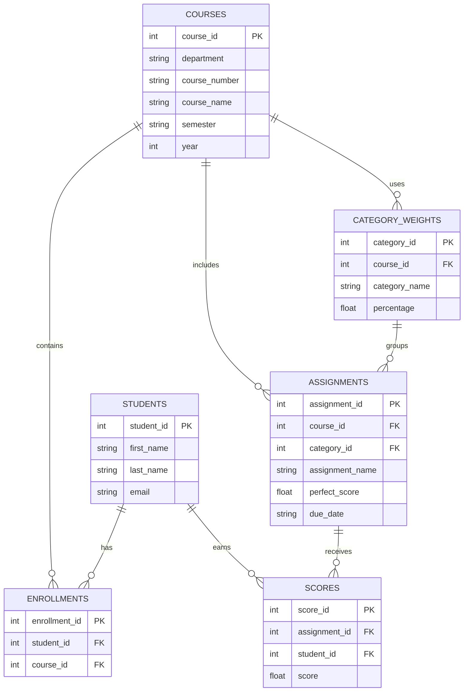

# ER Diagram

```mermaid
erDiagram
    STUDENTS ||--o{ ENROLLMENTS : has
    COURSES ||--o{ ENROLLMENTS : contains
    COURSES ||--o{ CATEGORY_WEIGHTS : uses
    CATEGORY_WEIGHTS ||--o{ ASSIGNMENTS : groups
    COURSES ||--o{ ASSIGNMENTS : includes
    ASSIGNMENTS ||--o{ SCORES : receives
    STUDENTS ||--o{ SCORES : earns

    STUDENTS {
        int student_id PK
        string first_name
        string last_name
        string email
    }

    COURSES {
        int course_id PK
        string department
        string course_number
        string course_name
        string semester
        int year
    }

    ENROLLMENTS {
        int enrollment_id PK
        int student_id FK
        int course_id FK
    }

    CATEGORY_WEIGHTS {
        int category_id PK
        int course_id FK
        string category_name
        float percentage
    }

    ASSIGNMENTS {
        int assignment_id PK
        int course_id FK
        int category_id FK
        string assignment_name
        float perfect_score
        string due_date
    }

    SCORES {
        int score_id PK
        int assignment_id FK
        int student_id FK
        float score
    }
```
